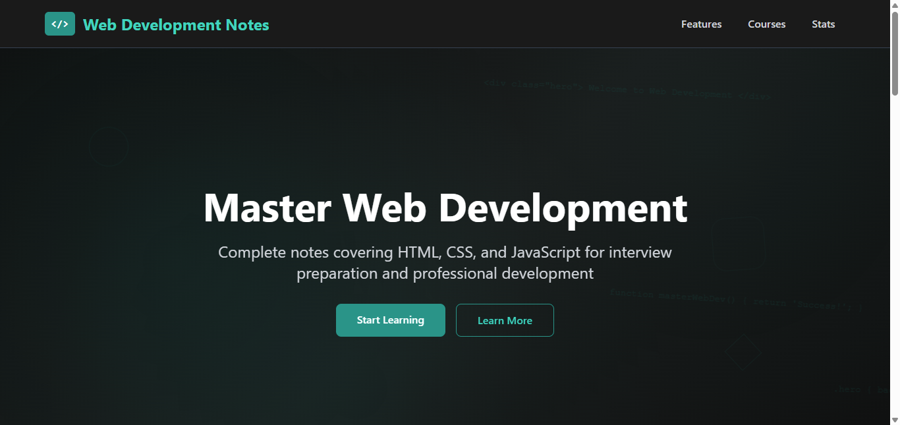
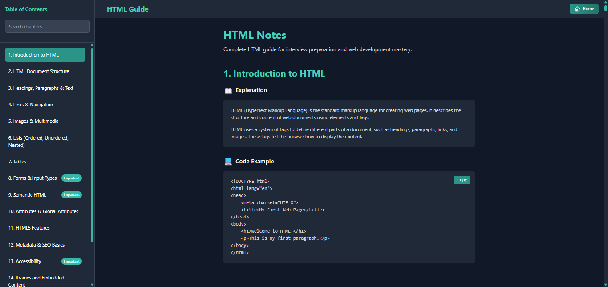
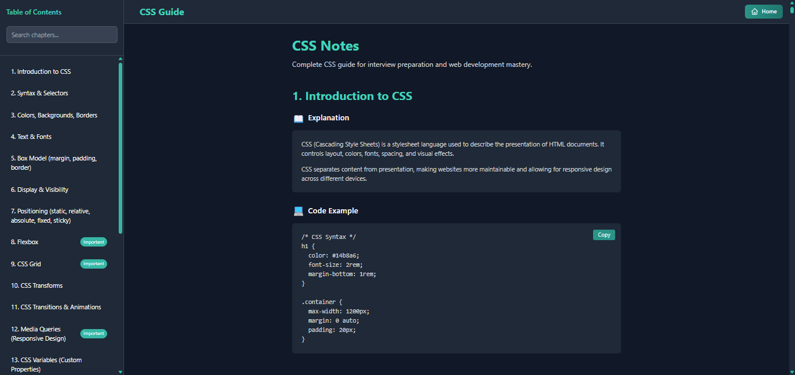
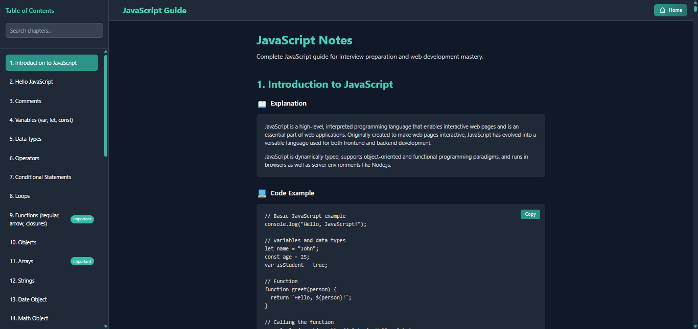

# 📒 Web Development Notes (HTML • CSS • JavaScript)


A comprehensive, responsive technical documentation website covering HTML, CSS, and JavaScript. It features a clean, organized layout with a mobile-responsive sidebar navigation, code examples with copy-to-clipboard functionality, chapter search with real-time filtering, and mobile-friendly hamburger menu design — perfect for interview prep and learning modern web development effectively.

## 📸 Screenshots

<div align="center">
  
  
  <p><em>Homepage with modern dark theme, course navigation cards, and responsive design</em></p>
  
  
  <p><em>HTML notes with structured chapters, sidebar navigation, and interactive examples</em></p>
  
  
  <p><em>CSS notes featuring responsive layout, dark theme, and highlighted code blocks</em></p>
  
  
  <p><em>JavaScript notes with quizzes, copy-to-clipboard, and smooth navigation</em></p>
</div>

## ✨ Live Demo

🌐 [View Web Development Notes](https://web-development-notes-shibam.vercel.app)

## 🚀 Features

- **📚 Comprehensive Content**: 72+ chapters total — HTML (16), CSS (22), JavaScript (34)
- **🗂️ Mobile-Responsive Navigation**: Sidebar with hamburger menu toggle for mobile devices and active-link highlighting
- **💻 Code Examples**: Copy-to-clipboard with visual feedback
- **📱 Fully Responsive**: Mobile-first design with hamburger toggle
- **🔍 Chapter Search**: Real-time chapter filtering with instant results
- **🎨 Modern Dark Theme**: Professional dark theme with teal accents (#14b8a6, #0d9488)
- **⚡ Smooth Navigation**: Smooth scrolling between sections with keyboard shortcuts (Ctrl+K for search, Escape to close)
- **♿ Accessibility**: ARIA labels, keyboard navigation, focus management, and semantic HTML structure
- **📖 Print Friendly**: Optimized printing styles
- **🔗 Deep Linking**: Direct links to chapters with smooth scroll

## 🎨 Design System

### Color Palette
- **Primary**: Dark theme backgrounds (#0f0f0f, #1a1a1a, #2a2a2a)
- **Accent**: Teal highlights (#14b8a6, #0d9488)
- **Text**: High-contrast white (#ffffff) and muted gray (#b0b0b0)
- **Code Blocks**: Dark code backgrounds with readable contrast

### Typography
- **Headings**: Clear hierarchy using semantic HTML
- **Body Text**: Readable sans-serif optimized for long-form reading
- **Code**: Monospace font for inline and block code

## 📱 Documentation Sections

1. **📘 HTML Notes** (16 chapters) — Structure, elements, forms, semantic HTML, accessibility, SVG graphics, web components
2. **🎨 CSS Notes** (22 chapters) — Selectors, box model, Flexbox, Grid, animations, responsive design, frameworks
3. **⚡ JavaScript Notes** (34 chapters) — Syntax, functions, DOM, events, async, ES6+ features, PWAs, security, build tools

Each chapter includes: Detailed explanations, interactive code examples with copy-to-clipboard functionality, practical analogies, common gotchas, quizzes, and comprehensive coverage of modern web development concepts.

## 🛠️ Tech Stack

- **⚡ Frontend**: HTML5, CSS3, Vanilla JavaScript (ES6+)
- **🎨 Styling**: Tailwind CSS framework with custom components and dark theme
- **🗂️ Navigation**: JavaScript-powered responsive sidebar with hamburger menu
- **💻 Code Display**: Syntax-highlighted code blocks with copy functionality
- **📱 Responsive**: Mobile-first design with breakpoint-based layouts
- **🔍 SEO**: Semantic HTML structure and comprehensive meta tags
- **♿ Accessibility**: WCAG-compliant with proper ARIA labels and keyboard navigation

## 🚀 Getting Started

### Prerequisites

- Web browser (Chrome, Firefox, Safari, Edge)
- Text editor (VS Code, Sublime Text, etc.)
- Basic knowledge of HTML, CSS, and JavaScript

### Installation

1. **Clone the repository**
   ```bash
   git clone https://github.com/Shibam-Code-Pro/web-development-notes-shibam.git
   cd web-development-notes-shibam
   ```

2. **Open the project**
   ```bash
   # Simply open index.html in your browser
   start index.html
   ```

3. **For development**
   - Use a local server like the Live Server extension in VS Code
   - Or use Python's built-in server: `python -m http.server 8000`

## 📁 Project Structure

```
web-development-notes-shibam/
├── 📄 index.html                     # Root hub page with navigation to HTML/CSS/JS notes
├── 📁 html-notes-shibam/             # HTML notes section
│   ├── index.html                    # HTML documentation with 16 chapters
│   └── script.js                     # Interactive functionality and navigation
├── 📁 css-notes-shibam/              # CSS notes section
│   ├── index.html                    # CSS documentation with 22 chapters
│   └── script.js                     # Interactive functionality and navigation
├── 📁 javascript-notes-shibam/       # JavaScript notes section
│   ├── index.html                    # JavaScript documentation with 34 chapters
│   └── script.js                     # Interactive functionality and navigation
├── 📸 screenshot/                    # Project screenshots
│   ├── web-development-notes-shibam.png  # Homepage screenshot
│   ├── html-notes-shibam.png        # HTML notes screenshot
│   ├── css-notes-shibam.png         # CSS notes screenshot
│   └── javascript-notes-shibam.png  # JavaScript notes screenshot
├── 📖 README.md                      # Project documentation
├── 📜 LICENSE                        # MIT License
└── 🚫 .gitignore                     # Git ignore rules
```

## 🛠️ Technologies Used

<table>
<tr>
<td align="center"><br><b>HTML5</b></td>
<td align="center"><br><b>CSS3</b></td>
<td align="center"><br><b>JavaScript</b></td>
<td align="center"><br><b>Git</b></td>
</tr>
</table>

## 🎯 Documentation Features

### 🗂️ Navigation System

- **Responsive Sidebar**: Desktop sidebar with mobile hamburger menu toggle
- **Active States**: Dynamic highlighting of current chapter sections
- **Smooth Scrolling**: Animated transitions between chapters and sections
- **Keyboard Shortcuts**: Ctrl+K for search focus, Escape to close menus

### 💻 Code Examples

- **Copy-to-Clipboard**: One-click copy functionality with visual feedback
- **Syntax Highlighting**: Color-coded code blocks for better readability
- **Interactive Elements**: Quizzes and practical examples throughout

### 📱 Responsive Design

- **Mobile Navigation**: Hamburger menu with slide-out sidebar for mobile devices
- **Flexible Layout**: Tailwind CSS responsive grid and flexbox layouts
- **Cross-Device**: Optimized for desktop, tablet, and mobile viewing

## 🌐 Deployment

### 🚀 Quick Deploy Options

1. **GitHub Pages**
   - Push to GitHub repository
   - Enable GitHub Pages in repository settings
   - Access via `https://username.github.io/repository-name`

2. **Netlify**
   - Drag and drop project folder to Netlify
   - Get instant live URL
   - Automatic HTTPS and CDN

3. **Vercel**
   - Import GitHub repository
   - Deploy with zero configuration
   - Perfect for documentation sites

### 🔧 Pre-Deployment Checklist

- ✅ Test all navigation links
- ✅ Verify responsive design on all devices
- ✅ Check code example formatting
- ✅ Test mobile navigation menu
- ✅ Update live demo URL in README

## 📊 Performance Features

- **Efficient Navigation**: Real-time chapter filtering with minimal DOM manipulation
- **Modern CSS**: Tailwind CSS for consistent styling and responsive design
- **Semantic HTML**: Proper heading hierarchy and landmark elements
- **Fast Loading**: Lightweight vanilla JavaScript with CDN-delivered Tailwind CSS
- **Accessibility**: Full keyboard navigation, focus management, and ARIA compliance

## 🔧 Customization Guide

### Adding New Sections

1. **Add HTML Content**: Create new sections/pages inside the respective folder
2. **Update Navigation**: Add links to the sidebar/navigation data
3. **Style the Content**: Add corresponding CSS rules
4. **Update JavaScript**: Include new sections in navigation logic

### Modifying Content

1. Open the relevant `index.html`
2. Locate the section to modify
3. Update content while maintaining HTML structure
4. Test navigation and responsive design

## 📝 License

This project is open source and available under the [MIT License](LICENSE).

## 🤝 Contributing

Contributions, issues, and feature requests are welcome! Feel free to open an issue or submit a PR.

## 📞 Contact

**Shibam Banerjee**
- Email: Connect-With-Shibam@outlook.com
- Phone: +91 62902-18960
- LinkedIn: [linkedin.com/in/shibam-webdev](https://linkedin.com/in/shibam-webdev)
- GitHub: [github.com/Shibam-Code-Pro](https://github.com/Shibam-Code-Pro)

## 🙏 Acknowledgments

- [MDN Web Docs](https://developer.mozilla.org/)
- [HTML5](https://developer.mozilla.org/en-US/docs/Web/HTML)
- [CSS3](https://developer.mozilla.org/en-US/docs/Web/CSS)
- [JavaScript](https://developer.mozilla.org/en-US/docs/Web/JavaScript)

---

⭐ If you found this project helpful, please give it a star! ⭐
